# 🎲 D&D Hub

A local-first, cross-platform D&D character manager built with Flutter — a fast, offline digital character sheet for use during actual game sessions.

**Current version:** `v1.0.0`  
**Status:** `v1.0.0` completes the planned core product: character management, local library, import/export, campaigns, GM mode, local LAN sync, Battle, Session Workspace and Gameplay State. After v1.0.0, there is no fixed feature roadmap; the project is developed iteratively based on real-world use, bugs, feedback, needs and new ideas.  
**Author:** [@MazZzoxa](https://github.com/MazZzoxa)

🇬🇧 [English](#-dd-hub) · 🇷🇺 [Русский](#-dd-hub-1)

<p align="center">
  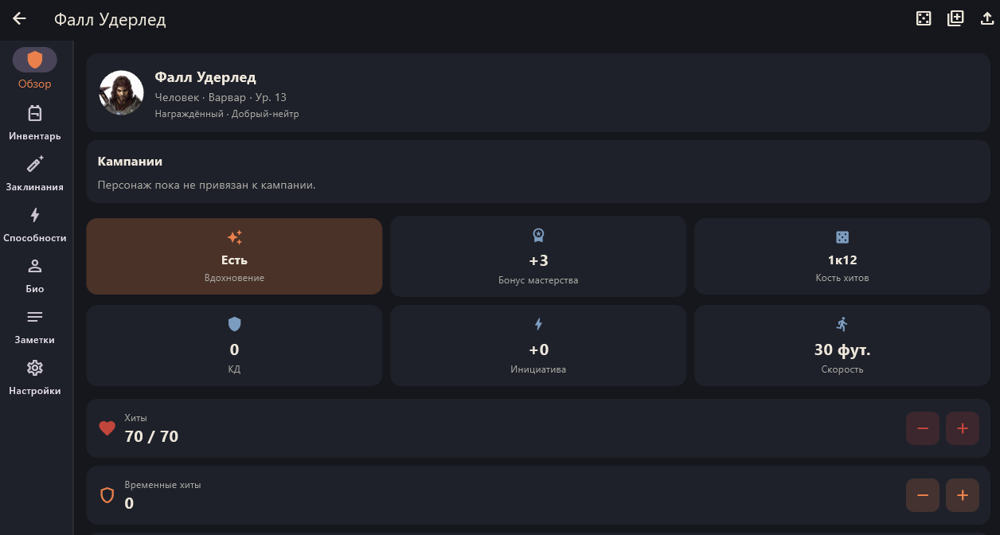
</p>

---

## 🎲 D&D Hub

### About

D&D Hub is a local-first digital D&D character manager designed to be used directly during a game session.

The main principle is **local-first**: no account and no mandatory Internet connection are required. Character, campaign and progression data remain stored locally in SQLite. During a hosted local game, the GM runs a temporary local FastAPI/WebSocket server and player devices keep a local SQLite replica. The GM and Player use different campaign interfaces and permissions.

### Features — v1.0.0

**Character management**

- Character profile: race, class, subclass, background, alignment and level
- Six core attributes with modifiers
- Combat stats: HP, temporary HP, AC, initiative, speed and proficiency bonus
- Quick +/- controls for HP, gold and XP
- Inventory: weapons, armor and miscellaneous items
- Spells with spell slots by level
- Abilities and attacks
- Freeform notes
- Bio with appearance, personality traits, ideals, bonds, flaws, backstory and character image
- Circular character avatars using the Bio image while preserving image proportions and quality

**Import / export and local library**

- PDF, URL and JSON import through a shared Import Manager
- Editable import preview before confirming imported data
- Local Content Library for items, spells, abilities and other content
- `.dndhub` character export/import
- Full local backup / restore
- XP history is preserved during character export/import

**Campaigns and GM Mode**

- Campaign creation and management
- Separate lists for campaigns you created and campaigns you joined
- Different GM and Player campaign interfaces and permissions
- Player membership, automatic LAN member creation and character linking
- Player can unlink their own character from a joined campaign without leaving the campaign
- GM character list excludes player characters linked to campaigns
- Player disconnect from a joined LAN campaign
- GM Dashboard for a selected campaign
- Player/character overview with HP, AC and initiative
- Read-only character sheet viewer for the GM
- Local Session Tools with an active session, GM notes and session history

**Local networking — v0.5.0**

- Windows GM local FastAPI/WebSocket server
- Android Player LAN discovery and Join flow
- Random invite tokens and QR/manual invite fallback
- Transport-independent sync protocol with stable network `sync_id` values
- Real-time sync for campaigns, members, sessions, characters, inventory, spells, abilities, attacks, notes, spell slots and XP history
- Authoritative in-memory GM server state with ordered event sequence numbers
- Full campaign snapshots for initial state and recovery
- Automatic reconnect with `resume(last_sequence)` and snapshot fallback
- Local SQLite remains the persistent replica on every device

**Battle Workspace — v0.6.1**

- Battle remains a separate persistent entity linked to a Session
- GM-controlled `Current Turn` with sequential `BattleTurn` history
- Initiative displayed as reference information without automatic turn ordering
- Battle Character View with `Overview` and `Actions` tabs
- Actions reuse existing attacks, spells, abilities and items instead of creating parallel content databases
- User-defined attack/effect formulas with an integrated Action Dice flow
- Target types: `Self`, `Ally` and text-only `External`
- Player `Action Request` flow with `Pending GM` → `Approved` / `Modified` / `Rejected` states
- GM can edit target/formulas/results before approval; original submitted values are preserved in request metadata
- Self/Ally approved effects can update synchronized Character State; External targets never modify enemy state
- Structured append-only Combat Journal with the last 100 events restored to reconnecting clients
- Existing direct GM Battle tools for Damage / Healing / Temporary HP remain available
- No enemies/NPCs, automatic initiative tracking, rounds, automatic turn order, battle map or automatic combat-rule resolution

**Session Workspace — v0.7.0**

- Session Workspace for both GM and Player
- Separate Session Journal with independently editable notes
- Session Events for gameplay events rather than database/audit operations
- XP Rewards linked to existing Character XP and XP transaction history
- Loot with `available → claimed` workflow before it enters Character Inventory
- Atomic GM commands for XP rewards and Loot claiming
- Unified Session History assembled from Session Events and the existing Battle Combat Journal
- Battle start/finish events appear in Session History without duplicating Battle Journal data
- Session start, resume and finish are recorded as Session Events
- Session Overview shows counts for notes, events, loot, battles and level-ups
- Session participants can be opened in a detailed read-only character view
- v0.6.1 `Session.notes` remains as legacy data and is migrated into a Session Note when upgrading the database
- GM has write access; Player has read-only Session Workspace access

**Gameplay State — v1.0.0**

- Character life state: `normal` → `downed` → `dead`, with GM-controlled recovery
- Death Saves remain separate from the life state; `HP = 0` does not directly mean death
- Conditions are persistent, synchronized character state with source, duration, scope and metadata
- Battle actions can apply or remove Conditions after GM approval
- Improvised actions using the existing `manual` Battle Action type
- One-time improvised actions and saved Custom Actions for repeated use
- GM rewards for XP, Copper, Silver, Electrum, Gold, Platinum and Inspiration
- Authoritative GM commands for HP, temporary HP, XP, currency, Inspiration, Conditions and life state
- Gameplay changes are represented in Session History through Session Events and Combat Journal
- v1.0 keeps the GM as the rules authority and the server as the synchronized gameplay-state authority

**Interface**

- Responsive Flutter UI
- Bottom navigation on phones
- Side `NavigationRail` on wide/desktop screens
- Shared widgets and data across platforms without duplicated business logic
- Primary orange buttons use white text and icons

### Tech stack

- **Client:** Flutter / Dart
- **Local storage:** SQLite (`sqflite` + `sqflite_common_ffi` for Windows/Linux/macOS)
- **State management:** Provider
- **Architecture:** layered — `presentation/` → `domain/` → `data/`

### Screenshots

The screenshots below show the current `v1.0.0` interface on Windows and Android. The gallery focuses on the main product flow: character management → campaigns → local LAN play → sessions → battle.

<table>
  <tr>
    <th>Area</th>
    <th>Windows</th>
    <th>Android</th>
  </tr>
  <tr>
    <td><strong>Character Overview</strong></td>
    <td></td>
    <td>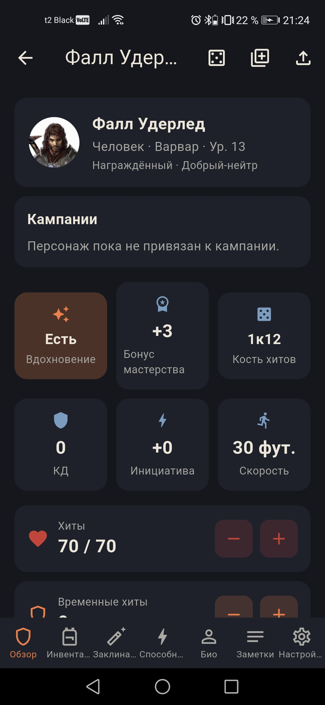</td>
  </tr>
  <tr>
    <td><strong>Character List</strong></td>
    <td>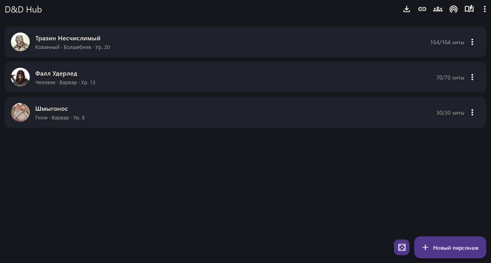</td>
    <td>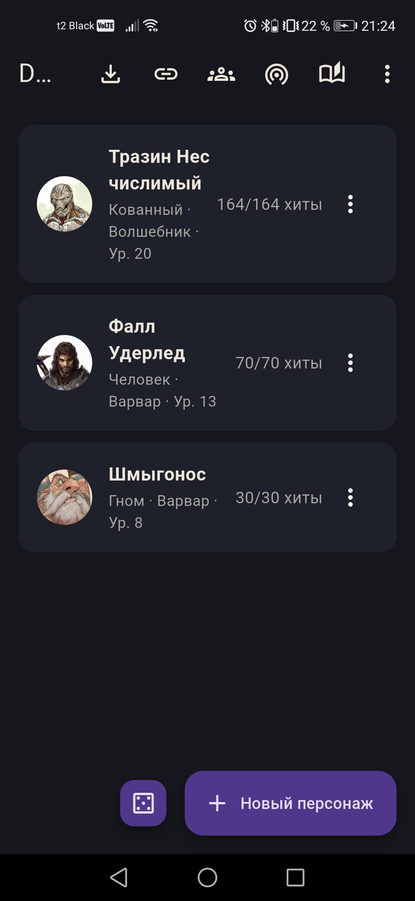</td>
  </tr>
  <tr>
    <td><strong>Local Content Library</strong></td>
    <td>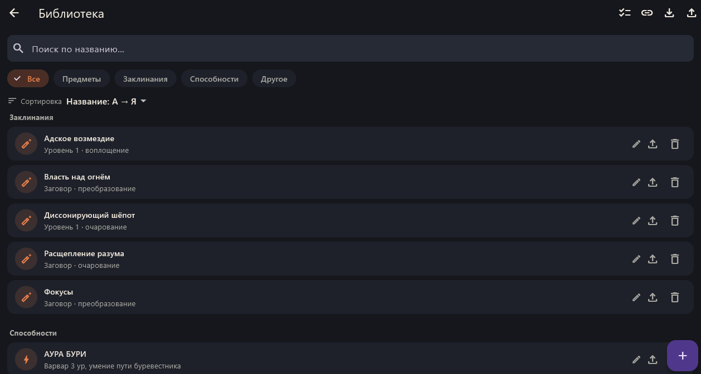</td>
    <td>—</td>
  </tr>
  <tr>
    <td><strong>Campaign</strong></td>
    <td>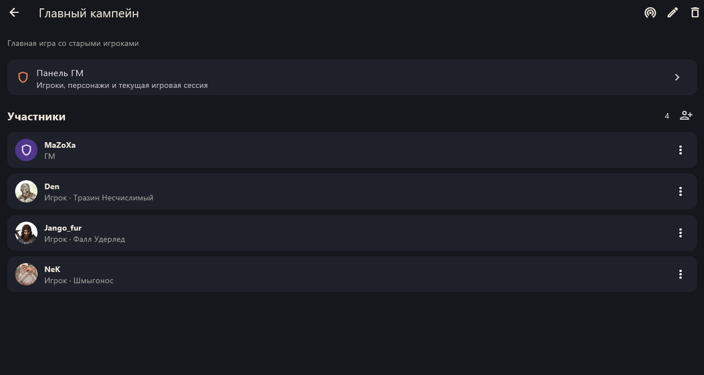</td>
    <td>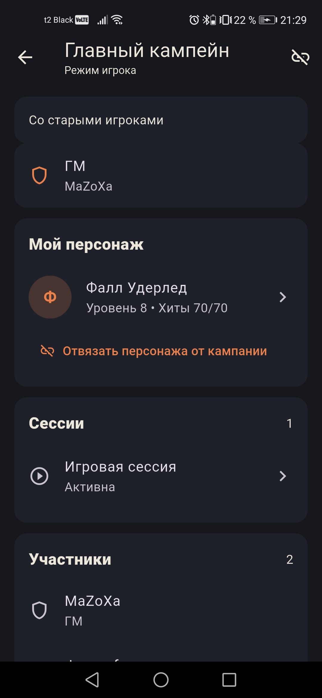</td>
  </tr>
  <tr>
    <td><strong>GM Dashboard</strong></td>
    <td>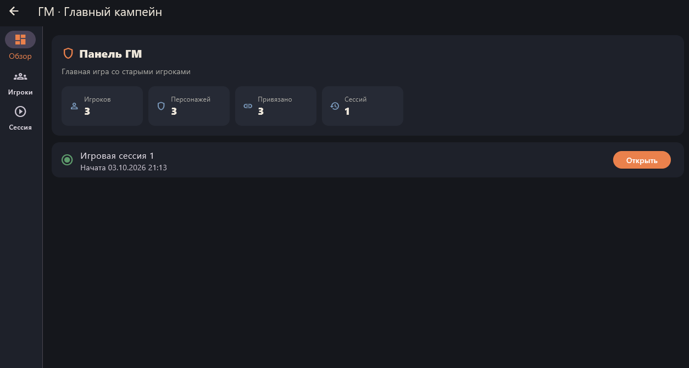</td>
    <td>—</td>
  </tr>
  <tr>
    <td><strong>Local LAN Game</strong></td>
    <td>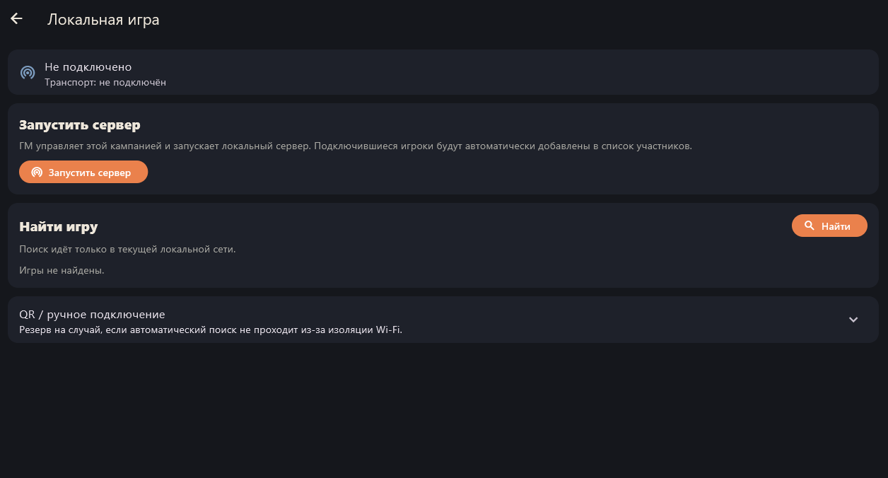</td>
    <td>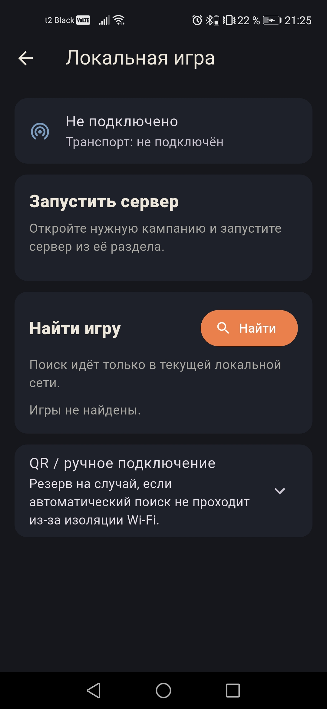</td>
  </tr>
  <tr>
    <td><strong>Session Workspace</strong></td>
    <td>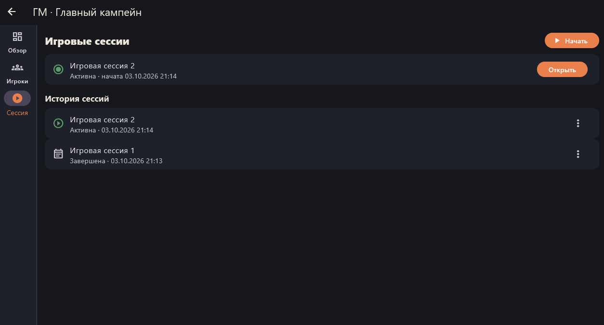</td>
    <td>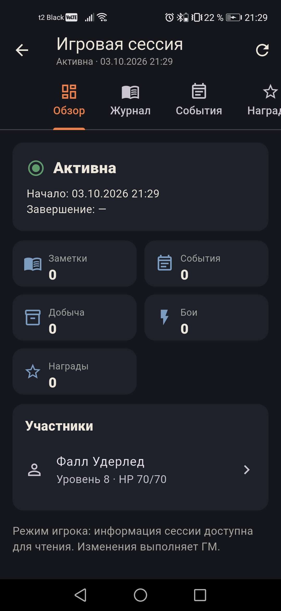</td>
  </tr>
  <tr>
    <td><strong>Battle Workspace</strong></td>
    <td>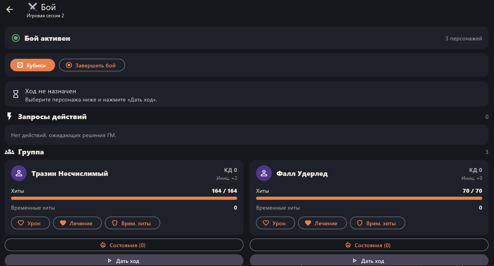</td>
    <td>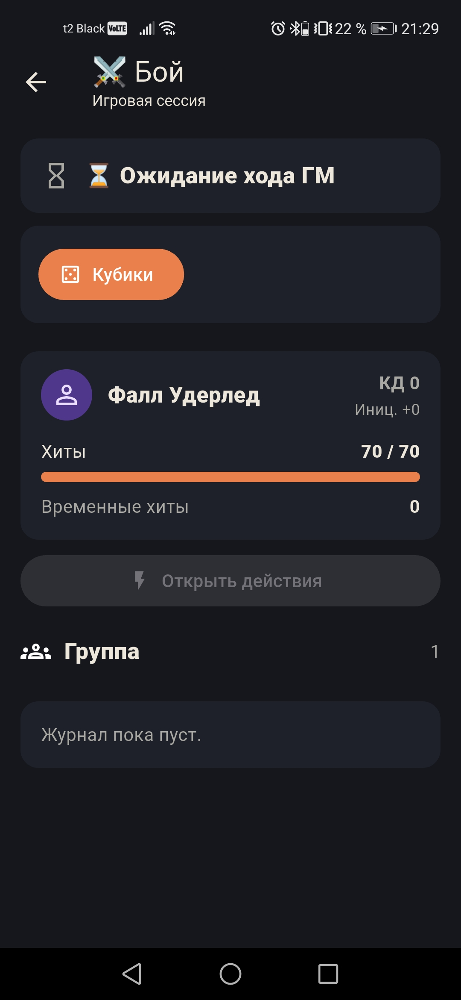</td>
  </tr>
  <tr>
    <td><strong>Battle Actions / History</strong></td>
    <td>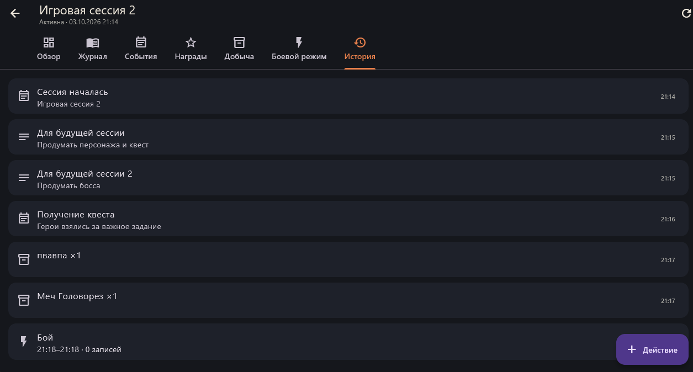</td>
    <td>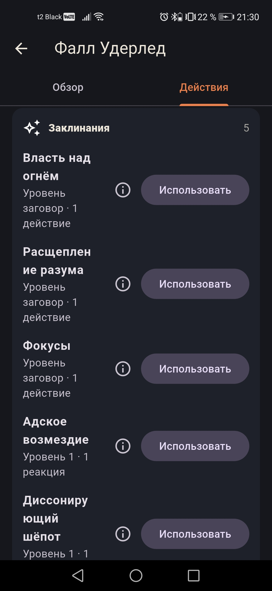</td>
  </tr>
  <tr>
    <td><strong>Bio</strong></td>
    <td>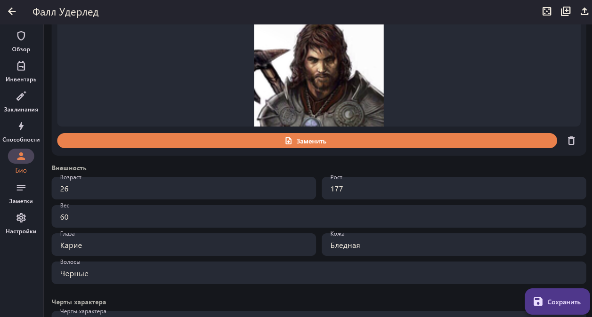</td>
    <td>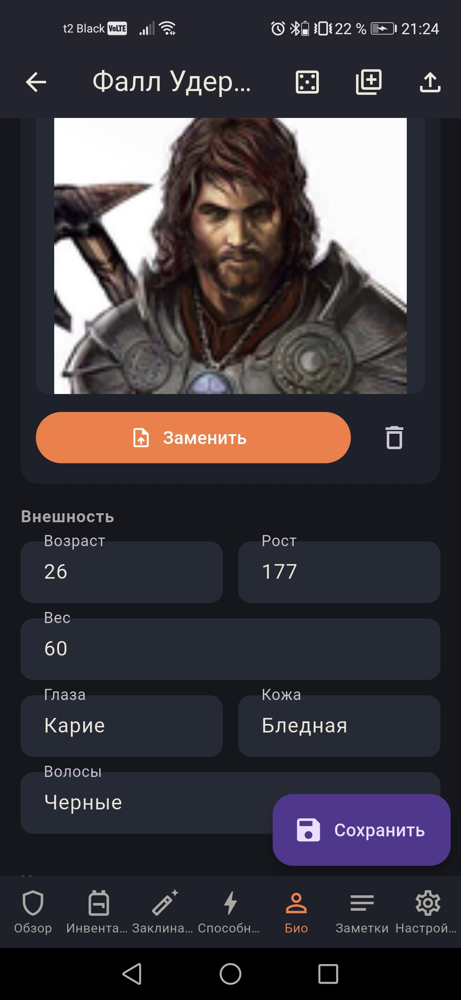</td>
  </tr>
</table>

Additional in-app features include Inventory, Spells, Abilities, Notes, Local Content Library, Import Preview, Conditions, Life State, Custom Actions, Session Rewards/Loot and Action Requests.

### Getting started

Requires Flutter SDK `>=3.3.0`.

```bash
cd client
flutter pub get
flutter run -d windows
```

Other targets can be used with the standard Flutter commands, for example an Android device/emulator or Chrome.

### Building

Windows debug build:

```bash
cd client
flutter build windows --debug
```

Android release APK:

```bash
cd client
flutter build apk --release
```

Build artifacts such as `client/build/` and Dart tool caches are ignored by Git.

### Project structure

```text
client/
├── lib/
│   ├── core/            # Theme and shared application infrastructure
│   ├── data/            # SQLite, repositories, models, import/export
│   ├── domain/          # Providers and application logic
│   └── presentation/   # Screens and reusable widgets
├── test/                # Unit and widget tests
├── assets/              # Application assets
└── pubspec.yaml

docs/
├── D&D Hub.md           # Full project plan and architecture notes
├── networking-v0.5.md   # Local transport and sync architecture
├── releases/            # Version-specific release notes
├── PDF Importer.md      # PDF importer documentation
```

### Roadmap

The planned roadmap ends with **v1.0.0**, which represents the complete core product.

| Version | Milestone |
|---|---|
| **v0.1** ✅ | Local character client |
| **v0.2** ✅ | Import/export, local content library, backup/restore |
| **v0.3** ✅ | Campaigns, participants, character linking, XP system |
| **v0.3.1** ✅ | Android migration, backup/restore and import fixes |
| **v0.4** ✅ | GM Mode, GM character viewer and local Session Tools |
| **v0.5.0** ✅ | LAN/WebSocket networking, automatic Player membership, GM/Player interfaces, campaign permissions and recovery |
| **v0.6.1** ✅ | Battle Workspace: turns, Actions, targets, Action Requests, GM review and Combat Journal |
| **v0.7.0** ✅ | Extended Session Workspace: Journal, Events, Rewards, Loot and unified History |
| **v1.0.0** ✅ | Complete core product: Gameplay State, Conditions, Custom Actions, GM Rewards, authoritative commands and extended history |
| **After v1.0.0** | Ongoing development based on real-world use, bugs, feedback, needs and new ideas |

There is no fixed list of v1.1, v1.2, v1.3 or later milestones. New versions will be released when there are meaningful improvements worth delivering.

Full detailed design document: [`docs/D&D Hub.md`](docs/D%26D%20Hub.md).

### Contributing

Issues and pull requests are welcome. Please keep changes consistent with the local-first architecture and the project plan in `docs/`.

### License

[MIT](LICENSE) — use and modify the project freely while keeping the license notice.

---

## 🇷🇺 Русский

### О проекте

D&D Hub — кроссплатформенный **local-first** менеджер персонажей D&D на Flutter, рассчитанный на использование прямо во время игровой сессии.

Главный принцип — **local-first**: аккаунт, сервер и обязательное подключение к Интернету не требуются. Данные персонажей, кампаний и прогрессии хранятся локально в SQLite. Во время локальной игры GM запускает временный локальный FastAPI/WebSocket-сервер, а устройства игроков сохраняют локальную SQLite-реплику. Интерфейсы и права GM и Player различаются.

### Возможности — v1.0.0

**Персонажи**

- Профиль персонажа: раса, класс, подкласс, предыстория, мировоззрение и уровень
- 6 базовых характеристик с модификаторами
- Боевые параметры: HP, временные HP, КД, инициатива, скорость и бонус мастерства
- Быстрые +/- регуляторы для HP, золота и XP
- Инвентарь: оружие, броня и прочие предметы
- Заклинания и ячейки заклинаний по уровням
- Способности и атаки
- Свободные заметки
- Био с внешностью, чертами характера, идеалами, привязанностями, слабостями, предысторией и изображением персонажа
- Круглый аватар персонажа на основе изображения из Био с сохранением пропорций и качества

**Импорт, экспорт и библиотека**

- Импорт PDF, URL и JSON через общий Import Manager
- Редактируемое превью импортируемых данных перед подтверждением импорта
- Локальная библиотека контента для предметов, заклинаний, способностей и других объектов
- Экспорт/импорт персонажа в `.dndhub`
- Полный локальный backup/restore
- История XP сохраняется при экспорте/импорте персонажа

**Кампании и GM Mode**

- Создание и управление кампаниями
- Отдельные списки созданных и присоединённых кампаний
- Раздельные интерфейсы и права GM и Player
- Автоматическое создание участника при LAN-подключении и привязка персонажа
- Возможность отключиться от присоединённой LAN-кампании
- GM Dashboard для выбранной кампании
- Обзор игроков и персонажей с HP, КД и инициативой
- Лист персонажа в режиме просмотра для GM
- Локальные инструменты сессии: активная сессия, заметки GM и история сессий

**Session Workspace — v0.7.0**

- Рабочее пространство Session для GM и Player
- Отдельный журнал Session Notes с независимым редактированием записей
- Session Events для игровых событий, а не технического audit log
- XP Rewards, использующие существующую систему XP и историю XP-транзакций персонажа
- Loot с workflow `available → claimed` до попадания предмета в Inventory персонажа
- Атомарные серверные команды GM для выдачи XP и распределения Loot
- Единая Session History из Session Events и существующего Combat Journal
- События начала/завершения Battle попадают в историю Session без копирования боевого журнала
- Начало, возобновление и завершение Session фиксируются как Session Events
- Обзор Session показывает количество заметок, событий, добычи, боёв и повышений уровня
- Из списка участников Session можно открыть подробный лист персонажа в режиме только просмотра
- Старое поле `Session.notes` сохраняется как legacy и при миграции переносится в Session Note
- GM может изменять Session Workspace; Player получает режим только для чтения

**Gameplay State — v1.0.0**

- Жизненное состояние персонажа: `normal` → `downed` → `dead`, с восстановлением под контролем GM
- Death Saves остаются отдельной механикой; `HP = 0` не означает автоматическую смерть
- Conditions хранятся как постоянное синхронизируемое состояние персонажа с источником, длительностью, областью действия и metadata
- Battle Actions после подтверждения GM могут накладывать и снимать Conditions
- Импровизированные действия на базе уже существующего типа `manual`
- Одноразовые импровизированные действия и сохранённые Custom Actions для повторного использования
- GM Rewards для XP, Copper, Silver, Electrum, Gold, Platinum и Inspiration
- Авторитетные GM-команды для HP, временных HP, XP, валюты, Inspiration, Conditions и жизненного состояния
- Значимые игровые изменения попадают в Session History через Session Events и Combat Journal
- GM остаётся источником истины для правил, а сервер — источником истины для синхронизируемого игрового состояния

**Интерфейс**

- Адаптивный Flutter-интерфейс
- Нижняя навигация на телефонах
- Боковая `NavigationRail` на широких/десктопных экранах
- Общие виджеты и данные для разных платформ
- Основные оранжевые кнопки используют белый текст и иконки

### Локальная сеть — v0.5.0

- GM запускает `Host Game` из выбранной кампании.
- Player открывает `Локальная игра` → `Find Game` и выбирает найденную кампанию.
- Подключение идёт по LAN через WebSocket; при необходимости можно использовать invite/QR или ручные параметры.
- Через `SyncService` синхронизируются кампания, участники, сессии, персонаж и связанные игровые данные (инвентарь, заклинания, способности, атаки, заметки, spell slots, XP).
- GM Server хранит authoritative state текущей LAN-сессии и нумерует события последовательностью.
- При обрыве соединения клиент автоматически пытается переподключиться; после reconnect отправляется `resume` по последнему sequence, а при необходимости сервер отдаёт полный snapshot.
- Локальная SQLite остаётся постоянной репликой; серверная память существует только в рамках запущенной GM-сессии.
- Wi-Fi P2P и Bluetooth пока не являются частью реализованного `v0.5.0` и остаются отложенными transport-опциями.

### Battle Workspace — v0.6.1

- Battle запускается только внутри активной Session и не завершает её.
- GM управляет `Current Turn`; каждый ход получает последовательный номер и сохраняется в истории.
- Initiative отображается как справочная информация и не превращается в автоматический трекер.
- Внутри Battle доступен `Overview` и отдельная вкладка `Actions`.
- Actions используют уже существующие атаки, заклинания, способности и предметы без создания параллельных баз.
- Формулы бросков задаются пользователем; Dice Roller встроен непосредственно в действие.
- Поддерживаются цели `Self`, `Ally` и текстовая `External`.
- Player отправляет `Action Request`; GM может принять, изменить или отклонить его.
- При изменении исходные значения Player сохраняются в metadata запроса.
- Подтверждённые эффекты по Self/Ally могут изменить синхронизированное состояние персонажа; External не изменяет состояние врагов.
- Combat Journal хранится структурированно, работает как append-only история и восстанавливает последние 100 событий при reconnect.
- Прямые GM-инструменты Damage / Healing / Temporary HP из v0.6 остаются доступны.
- Battle Workspace не реализует врагов/NPC, автоматический initiative tracker, раунды, автоматический порядок ходов, карту боя или автоматическое применение боевых правил.

### Запуск проекта

Требуется Flutter SDK `>=3.3.0`.

```bash
cd client
flutter pub get
flutter run -d windows
```

Для других платформ используются стандартные команды Flutter.

### Сборка

Windows:

```bash
cd client
flutter build windows --debug
```

Android APK:

```bash
cd client
flutter build apk --release
```

Файлы сборки и кэши Flutter/Dart исключены из Git через `.gitignore`.

### Структура проекта

```text
client/
├── lib/
│   ├── core/            # Тема и общая инфраструктура
│   ├── data/            # SQLite, repositories, models, import/export
│   ├── domain/          # Providers и логика приложения
│   └── presentation/   # Экраны и переиспользуемые виджеты
├── test/                # Unit/widget tests
├── assets/              # Ресурсы приложения
└── pubspec.yaml

docs/
├── D&D Hub.md           # Полный план и архитектурные заметки проекта
├── PDF Importer.md      # Документация PDF-импортёра
```

### Roadmap

Запланированная разработка завершается на **v1.0.0**, где собран полный основной функционал D&D Hub.

| Версия | Этап |
|---|---|
| **v0.1** ✅ | Локальный клиент персонажа |
| **v0.2** ✅ | Импорт/экспорт, локальная библиотека, backup/restore |
| **v0.3** ✅ | Кампании, участники, привязка персонажей, система XP |
| **v0.3.1** ✅ | Исправления Android, backup/restore и импорта |
| **v0.4** ✅ | GM Mode, просмотр персонажей и локальные Session Tools |
| **v0.5.0** ✅ | Локальный GM-сервер + LAN-синхронизация в реальном времени, роли GM/Player и управление участниками |
| **v0.6.1** ✅ | Battle Workspace: ходы, Actions, цели, Action Requests, GM review и Combat Journal |
| **v0.7.0** ✅ | Extended Session Workspace: Journal, Events, Rewards, Loot и единая History |
| **v1.0.0** ✅ | Завершённый основной продукт: Gameplay State, Conditions, Custom Actions, GM Rewards, авторитетные команды и расширенная история |
| **После v1.0.0** | Дальнейшее развитие по мере использования, исправления ошибок, обратной связи, необходимости и появления новых идей |

Фиксированного списка v1.1, v1.2, v1.3 и последующих версий больше нет. Новые версии будут появляться тогда, когда накопятся действительно полезные изменения.

Полный подробный план разработки: [`docs/D&D Hub.md`](docs/D%26D%20Hub.md).

### Лицензия

[MIT](LICENSE) — проект можно свободно использовать и изменять с сохранением уведомления о лицензии.

